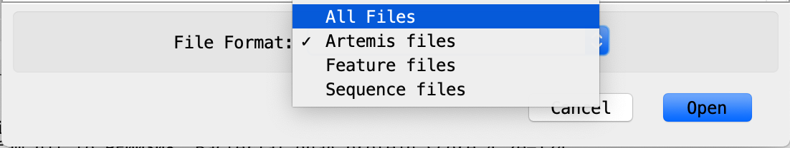

# Jenna Lam, Supplementary material for thesis

Supplementary material/Appendix for the thesis Condition-dependent transcriptional landscape of Campylobacter jejuni

To view the Artemis file containing promoters identified from Cappable-seq i.e. Cappable-seq_promoters.txt first ensure you have Artemis installed on your computer.

To download and install Artemis please follow this link http://sanger-pathogens.github.io/Artemis/Artemis/ and select the appropriate operating system. 

Once Artemis is installed, please download the Genbank file 11168_genbank.gb, the GFF file 11168_genome_with_ncRNAs.gff3.gff, and the file containing all the promoter information Cappable-seq_promoters.txt for visualisation on Artemis, which will greatly help with understanding the results for Chapter 4. 

N.B. Although the GenBank file was downloaded from NCBI, the current version may have minor changes. The file we have used for analysis is 11168_genbank.gb but the viewer is free to download the latest version at https://www.ncbi.nlm.nih.gov/genome/149?genome_assembly_id=299213 

If the viewer is not familiar with Artemis, there are instructions below to guide you through the process:

Open Artemis, and click File > Open ...

Select the GenBank file and open the file. If a warning message appears asking to view the warnings, click No. 

Once the GenBank file has been loaded you will be able to scroll across the annotated genome. To add the promoter information, click File > Read An Entry 

Before selecting for the Cappable-seq_promoters.txt file, change the file format to > All files to enable selection.

Once the file is loaded, you will be able to view the promoters visually and also highlight each promoter. At the bottom there is information on each annotated promoter including the name, type, sigma factor preference, source, enrichment, and TSS identifier. 

